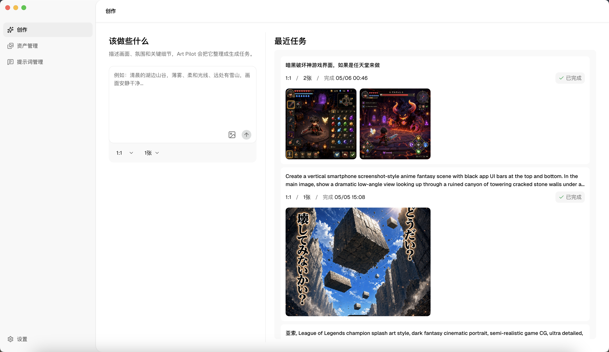
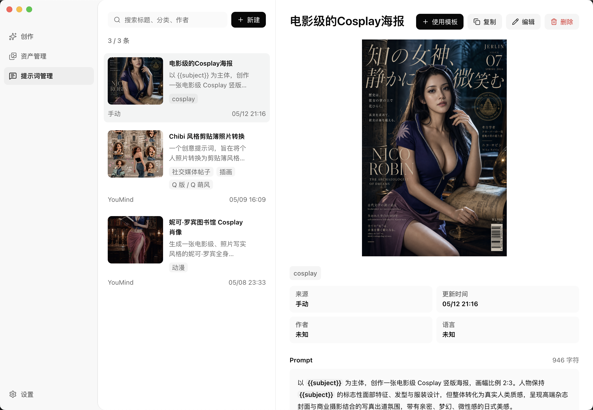
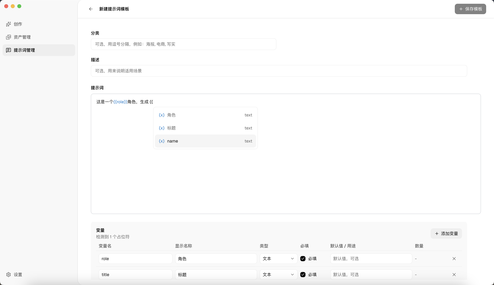

# Art Pilot

Art Pilot 是一个 macOS 桌面应用，用来把 Codex 图片生成能力变成更完整的视觉创作工作台。它可以生成图片、管理提示词模板、保存历史素材，并把一次满意的结果继续带回下一次创作。



## 适合谁

- 已经在使用 Codex 生成图片，希望把提示词和素材沉淀下来的人。
- 需要反复调整风格、参考图、系列图的设计师、运营或独立创作者。
- 想把高质量 prompt 做成模板，减少重复填写的人。

## 使用前提

使用 Art Pilot 前，请先准备好：

- 一台 macOS 设备。
- 已安装并登录 Codex CLI。
- Codex 账号拥有可用的图片生成能力。

Art Pilot 不需要你额外配置 OpenAI API Key，也不会要求单独填写图片生成 API。

## 安装

1. 打开 GitHub Releases 页面。
2. 下载最新的 `Art.Pilot-版本号-arm64.dmg` 或对应架构的 DMG。
3. 双击打开 DMG，把 `Art Pilot` 拖到 `Applications`。
4. 从“应用程序”中打开 Art Pilot。

当前公开构建没有 Apple Developer ID 签名和公证。首次打开时，macOS 可能会拦截。你可以到：

```txt
系统设置 -> 隐私与安全 -> 仍要打开
```

然后再次打开应用。

## 首次配置

### 1. 检查 Codex 环境

打开 Art Pilot 后，进入：

```txt
设置 -> 环境检测
```

确认这些状态正常：

- 登录状态：已登录
- CLI 安装：已安装
- CLI 版本：显示当前 Codex 版本
- CLI 路径：显示本机 Codex 命令路径

如果提示未登录，请在终端运行：

```bash
codex login
```

完成登录后，回到 Art Pilot 重新进入环境检测页。

### 2. 设置图片库目录

进入：

```txt
设置 -> 数据存储
```

选择你希望保存生成图片的位置。Art Pilot 会把生成记录、素材和后续继续创作用到的信息保存在本机。

### 3. 开始创作

进入“创作”页面，输入 prompt，选择需要的参考图或模板变量，然后开始生成。

## 核心功能

- **Codex 生图**：复用本机 Codex 能力生成图片。
- **提示词模板**：把成熟 prompt 做成模板，支持文本变量和图片变量。
- **素材管理**：自动保存生成图片，支持收藏、查看详情和打开本地文件。
- **继续创作**：从历史图片带回 prompt 和参考图，继续生成变体。
- **本地优先**：图片和创作历史保存在本机，方便长期管理个人素材库。

## 产品截图

### 资产管理


### 从资产继续创作


### 提示词管理



### 新建提示词模板



## 常见问题

### macOS 提示应用无法打开怎么办？

当前构建没有 Apple Developer ID 签名和公证。请打开：

```txt
系统设置 -> 隐私与安全 -> 仍要打开
```

如果仍然无法打开，可以在终端执行：

```bash
xattr -dr com.apple.quarantine "/Applications/Art Pilot.app"
open "/Applications/Art Pilot.app"
```

### 提示“未找到 Codex CLI”怎么办？

请先确认终端里可以运行：

```bash
codex --version
```

如果终端也找不到，请先安装 Codex CLI。安装完成后重新打开 Art Pilot。

### 提示“Codex 已安装，但 Node 环境不可用”怎么办？

这通常说明 Codex CLI 依赖的 Node.js 没有被当前应用环境找到。请确认终端里可以运行：

```bash
node --version
codex --version
```

如果你使用 nvm，建议在终端重新安装或刷新 Codex CLI，然后重新打开 Art Pilot。

### 提示需要登录怎么办？

请在终端运行：

```bash
codex login
```

登录成功后回到 Art Pilot，再次查看“设置 -> 环境检测”。

### 如何查看当前应用版本？

进入：

```txt
设置 -> 关于
```

反馈问题时，请带上这里显示的版本号。

### 数据保存在哪里？

图片库目录可以在：

```txt
设置 -> 数据存储
```

中查看和修改。应用数据库保存在 macOS 的应用数据目录中。

## 如何反馈问题

反馈问题时，请尽量提供：

- Art Pilot 版本号。
- macOS 版本。
- 使用的是 Apple Silicon 还是 Intel Mac。
- 问题发生在哪个页面。
- 截图或错误提示。
- 你是否能在终端正常运行 `codex --version` 和 `codex login status`。

可以在 GitHub Issues 中提交问题。

## 面向开发者

本仓库使用 pnpm workspace，桌面端应用位于 `apps/desktop`。

安装依赖：

```bash
pnpm install
```

启动开发环境：

```bash
pnpm dev
```

类型检查：

```bash
pnpm typecheck
```

构建当前默认架构 DMG：

```bash
pnpm dist:dmg
```

构建 Apple Silicon DMG：

```bash
pnpm dist:dmg:arm64
```

构建 Intel Mac DMG：

```bash
pnpm dist:dmg:x64
```

构建 Universal DMG：

```bash
pnpm dist:dmg:universal
```

只验证 Vite/Electron 构建，不运行 electron-builder：

```bash
pnpm --filter @art-pilot/desktop exec vite build
```

## 发布说明

当前公开构建使用 ad-hoc 签名，不包含 Apple Developer ID 签名和 Apple notarization。它适合早期测试和小范围分发；如果要做更正式的公开分发，需要补充 Developer ID 签名和 notarization。
