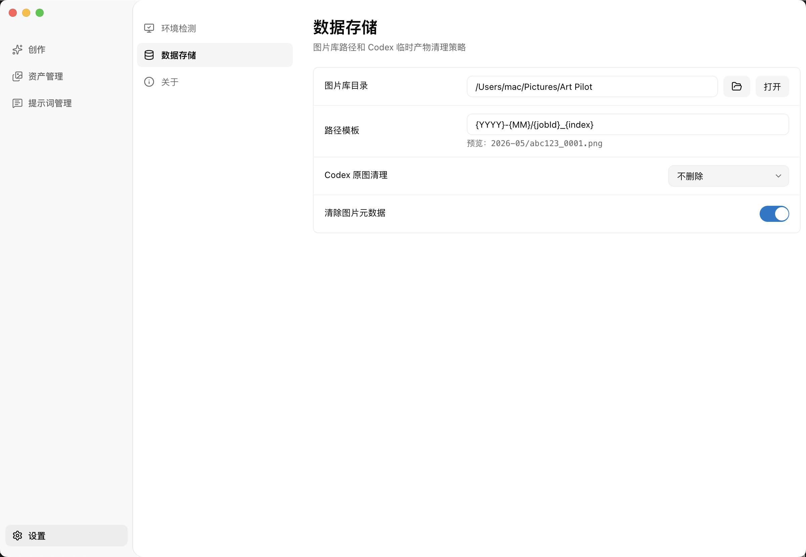

# Art Pilot

[简体中文](README.zh-CN.md)

Art Pilot is a macOS image creation workspace for Codex. It helps you manage prompt templates, organize generated images, keep local assets, and continue new variations from previous results.

## Download

Installers are available on GitHub Releases:

[Download Art Pilot](https://github.com/DBAAZzz/art-pilot/releases)

Download the latest `.dmg`, then drag `Art Pilot` into `Applications`.

Art Pilot uses your local logged-in Codex environment. No separate OpenAI API key is required. Before first use, make sure Codex CLI is installed and logged in on your Mac.

## Features

- **Image generation**: Generate images with Codex from a desktop app.
- **Prompt templates**: Save reusable prompts with text and image variables.
- **Asset management**: Organize generated images, favorites, and local files.
- **Continue creation**: Bring prompts and reference images back from history to create variations.
- **Local storage**: Keep images and creation history on your computer.

## Screenshots

### Asset Management

### Continue From Assets

### Prompt Management

### New Prompt Template

### Settings

## Notes

- If macOS blocks the app on first launch, open `System Settings -> Privacy & Security` and choose `Open Anyway`.
- If Art Pilot reports a Codex environment issue, check `Settings -> Environment Check`.
- The image library location can be changed in `Settings -> Data Storage`.

## Feedback

Issues and suggestions are welcome on GitHub:

[Submit an issue](https://github.com/DBAAZzz/art-pilot/issues)
